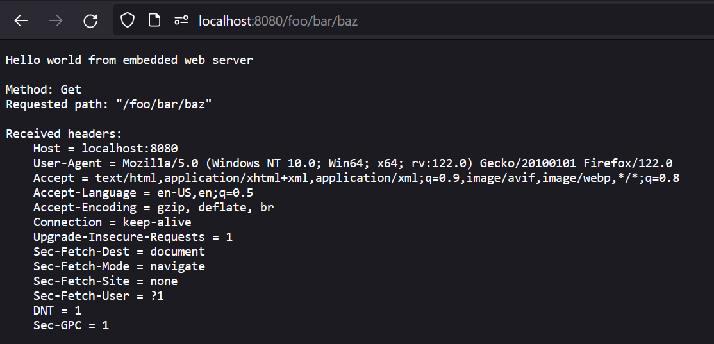

# no_std embeddable webserver

This is a prototype web server that can be used in `no_std` environments like on embedded systems. It uses no memory allocations and should be completely infallible.

An example implementation is provided in `runners/desktop`. Runners can be implemented in environments with `std` and memory allocation. This will not impact the server implementation.

To implement the server:
1. Create a type that implements `ServerConfig`. This will handle the incoming and outgoing messages.
2. Create a type that implements `Connection`. This will handle the individual requests.
3. Create a new instance of `Server<T, N>` where `T` is your `ServerConfig` implementation and `N` is the amount of concurrent connections the server should be able to handle.
   1. Note that all connections are always allocated on the stack, so keep this number small on low power devices.
4. Feed this server with:
   1. `new_connection(addr)` when a new connection comes in.
   2. `client_disconnected(addr)` when a connection is disconnected.
   3. `data_received(addr, &[u8])` when data is received from an address.
   4. `poll_write()` when the server is ready to send data.

# Example response

